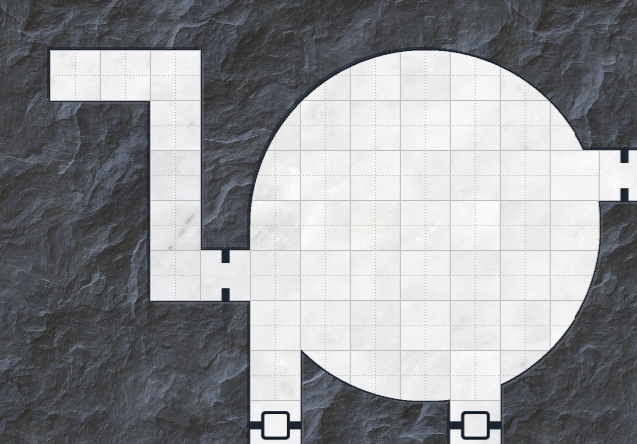
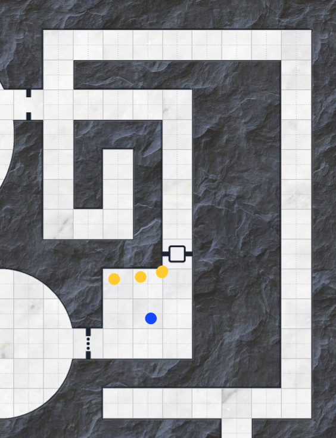
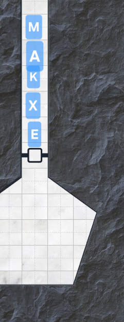
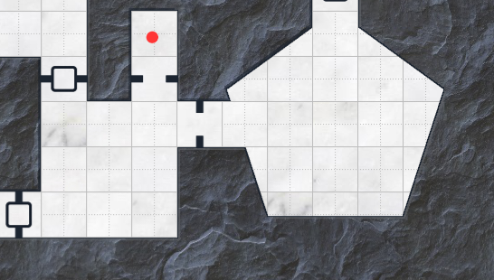

Session 2
=========

**Session Date:** 28 Jun 2025

# Character Key

| Shorthand | Name   | Class    |  Species    |
| --------- | ------ | -------- | ----------- |
|     X     | Klaxon | Fighter  | Aarakocra   |
|     E     | Eryn   | Cleric   | Dwarf       |
|     A     | Artyn  | Sorcerer | Human       |
|     M     | Melody | Psionic  | Deep Gnome  |
|     K     | Kefira | Dancer   | Fire Genasi |

# Notes

- so God (read: our GM) has lost the notebook with all the plans...
    - but the show must go on!
- after 'The Gang's First Big Day Out' (TM)
- we wake up in the dilapidated ass observatory
    - Spacecat has clearly been squatting here some time
    - but everything else is great!
    - but also Spacecat is only cool with this for like a day
- Klaxon is the first to rise
    - and NO he doesn't cockadoodledoo and so he doesn't wake everyone up you BUNCH OF RACISTS
- Klaxon wants to take a look around the observatory
    - goes outside
    - is same on the outside, is gross
- there is an askew fence that Klaxon finds
    - this askew-ness bothers him greatly
    - this must be corrected
    - finds big rock, hits fence
    - it is...mostly back in place
- Melody is up next and...cleaning??
    - 'cleanliness is next to godliness'
    - Melody finds a book...and it isn't even that moldy!
    - ...but she can't read it, is written in indecipherable scribbles
    - seems very neat and orderly...potentially not by a hand (automated)
- Melody has many questions....IDENTIFY!
    - God: FUCK YOU! (this was not planned)
    - well it was written with a prestidigitation (mage hand) spell
    - it appears to be written in Abyssal
    - appears to be a spell tome of some kind...but of what, unknown
- Eryn is up next, rising early with ***le sea***
    - everyone is still a RACIST! (editor's note, I do not recall this specific instance of avian-racism but I am sure it happened so it remains)
    - to the kitchen...I mean...um...the galley!
    - there is a side closet in the observatory that Spacecat has been using for a kitchen
    - this is where Spacecat seldom prepares food
    - find some coffee, wine, moldy bread, and...a white box
    - OMG SPACECAT GOT KRISPY KREME WEEDNUTS
    - Eryn smashes
    - until Eryn's next short rest, -1 on all phys atts, +1 on all mental
    - he did find some coffee though
- Art (who casts sleep on hisself to go to bed) awakes to the smell of weednuts
    - Eryn is like yeah the weednuts are for us (probably)!
    - Art takes one as well (same effects for Art now)...ITS MEDICINAL YOU DRUG RACISTS!
        - probably double chocolate?
    - Art is like:
        - how did we get here....maaan?
        - I lit shit on fire and...then I was here?
    - Eryn & Melody: yeah pretty much
- Kefira awakes
    - there are some Bmire benches in the back that are meant for stargazing
    - does some early morning yoga
    - Kefira's thoughts are a bit muddled at this point
- wait...where is Spacecat?
    - Melody: HERE KITTY KITTY KITTY
    - Art: should we take another weednut?
    - Melody checks the under the carpet, the closets, etc.
- Klaxon checks the roof
    - poops on the telescope lens
    - does not see Spacecat anywhere outside
- there is no obvious indicator of where Spacecat went
- Eryn how's about we go to the Krispy Kreme?
    - Melody to Eryn: do they have crullers??
    - Eryn: ***ah oui, zey have le crullers***
- we go to the Krispy Kreme and speak with the nut-tender
    - Eryn: ***duex french crullers*** ... um ... ***por favor***
    - Klaxon: good sir do you know where...one would buy...the good good?
    - the nut-tender is like, please get out
- Melody: sergeant birdy, can you read this book?
    - Klaxon: ...no
    - Melody: general birdy?
    - Klaxon: still no
    - Kefira: can speak primordial, nothing useful but is funny
- we leave the Krispy Kreme
- Melody: can I investigate for the demon things?
    - rolls for investigation (23)
    - God: no
    - rolls for perception (21)
    - God: fine, there is a bar called Hell's Kitchen
- Melody: bangs on the door, enters
    - there's like two big guys
    - Melody: hey hi can you reads this book?
    - Melody misgenders the bartender and they are like please kindly GTFO
    - Klaxon walks in and is like omg I am so sorry do you know who speaks abyssal?
        - the workers are like huh?
    - Klaxon: alright its time to leave
    - Melody: **casts friends!**
    - Klaxon is like no no no no grabs Melody and pulls her from the bar
    - Melody: shoots a rat with the friend spell, new rat friend
- we arrive at the bar
    - Klaxon: knocks with an incredibly melodic knock, but nothing happens
    - Eryn/Kefira: can we like, look in the window?
    - Eryn: high-as-a-kite checks the window, sees a group of people huddled over a table
    - they are looking at...something
    - Spacecat is not present, but there is someone that we recognize from the bar
- Eryn: the building is made of stone!
    - Eryn is a gnome and knows his stone real good
    - there should be fire codes and shit and so should be a back entrance
- to the back, but the door is also locked
    - but this door is not as dangerously visible as the front door
    - Kefira tries to jimmy it w/ her dagger
    - Kefira is able to pop it open
- Art is also a bartender and might be able to sneak inside!
    - we start developing a plan to sneak in super good like
    - then the employees come through and are like, you know we heard you knock earlier right?
    - ...just come in!
- Art walks in first
    - Natalia asks Art, what are you looking for?
    - (should we be keeping up the ruse?)
    - Art: naw they definitely heard our whole plan
    - Melody: I can cast friends!
        - collectively: ....no!
- they are guarded but not hostile....
    - Art: we are looking for Spacecat but also you got any more weednuts?
    - Nat: no idea where Spacecat is
    - Art: y'all heard about that Kevin Plank?
    - Nat: yes we must kill him
    - (entire party, in unison): yes we must kill him
    - Nat: come in!
- we look over the papers
    - there is one large map with ley lines detailed
    - the lines extend from the city center outwards
    - Melody: are they lookin for the goo?
    - yeah that's what it looks like
- Nat: would love to talk, but there's an emergency...
    - there are several other people missing
- wait pause, who's all in this bar?
    - well there's Bobo and Milly and Kit and Bailey...
    - they are adorable doofuses that above all else must stay inside or they will def die
- Nat: the missing people are focused in several specific areas
    - the local homeless folks are going missing
    - Bmire doesn't care, big shock
    - been growing as a problem, centered in one location (Dundalk)
- do we go to the town center or the Dundalk?
    - alright let's go to Dundalk hon
- we talk for a long time about about John Waters
    - Natalia is so through with us at this point
    - Art: y'all know anything about this Dundalk?
    - Nat: naw
    - Dundalk smells like an asshole...intentionally
- Melody: hey any of y'all know about the End War?
    - confusion, mystery, what is this End War?
    - no, this seems like something your dad lied to you about...
- off to Dundalk!
    - smells like ass, as predicted
    - there are people, but they are all inside
    - Melody investigates, finds a little blood trail
    - we follows it, we find the grove of Dundalk
    - we follows it the other way and it leads to a manhole
    - we open it and Melody just JUMPS RIGHT IN
        - four points of fall damage
    - Klaxon really does not like this underground business but heads down
- WELCOME TO BELMIRE'S NEWEST GAMESHOW: POO OR GOO?
    - poo, it's all poo in Dundalk
- everyone but Art has darkvision
    - but like light is good regardless so Art casts some light
- we investigate and pick the blood trail back up
- intermission (🎶let's all go to the lobby🎶)
- enter a big round room
    - we look up!
    - this place is very dank (no not in a fun way)
    - we lose the blood trail in this room

- Melody really wants to smell and taste the blood
    - no no please do not do this omg
- there are like a bunch of doors and hallways
    - they are laid out like a person with glasses, feets, etc.
- let's check out these feet doors
    - the right-side door is wedged
    - the left-side door is more sturdy, but is also rusted shut
- we go through the butt to reveal an F
    - there is a shit shaft
    - Eryn: ***ah...le poop deck***
    - Melody runs ahead and examines the poop deck

- Kefira goes to check the door
    - it locked
- alrighty well we go back to the middle of the F
    - there's another door, this time it is unlocked!
    - there are three demonic masks that are...well hung
    - Melody tries to grab one but K is like hell naw
    - actually, you know what, sure let her do it
    - nothing happens
    - we grab the rest of the masks and a key off the ground

- one of the paths is blocked by a wooden barricade
    - do we burn/explode the wooden barricade??
    - no, explosion bad, also smoke bad
- Melody tries to shove Eryn through the barricade
    - the unstoppable force meets the immovable object
- actually, let's go back and use the key on the poo door
    - it opens!
    - small doorway into a small corridor into a room
- how do we enter the room?
    - order is Eryn-Klaxon-Kefira-Art-Melody

- Eryn runs into a crab people!
    - we debate the initiative order a bit
    - ah! the crab is leaking black goo!
    - these crabs is still blue though babyyyy
- Eryn is sprayed with some poison acid goop
- Melody runs through everyone and gives Eryn some healy
- Kefira to Klaxon: duck! (lol)
    - Kefira hits the crab for some points
- Eryn takes out his crab mallet and whacks it real good
    - carb is ded
- 3 more demon masks here
- blood all over the floor of this chamber
- these masks are just as cool as the current masks but in a different way
    - Melody wants the other mask
    - goes to grab, but oh no booby trap!
    - gets poison holed, takes 3 damage
    - Eryn is like, maybe we don't touch all the creepy things here, and heals Melody
- the booby trapped mask 'splodes
    - so now we got 5 masks total
- we continue through the hallway
    - there is another poop deck
    - there is also an open wooden door
    - Kefira carefully opens it cuz we don't want to be hit by more booby traps
- looong hallway
    - cast fireball to see down the hallway
    - accidentally lights the same wooden barricade on fire
    - quick kill it with stomp
    - stomp is very effective

- we continue down the long hallway
    - yet another poop deck
- we try some more doors leading north, but they are rusted shut
    - we are fresh outta lube for the rust
    - Eryn tries to slam open the door, nat 1, only damages himself
- Art tries the poop drains
    - are they buttons?
    - no they just drain poop
- Kefira and Klaxon both try to shoulder check the left side of the glasses and it opens easily
    - look Eryn just slipped on some poo okay?

- there's a rat in here!
    - Eryn is ***le tired***, he take a nap
    - these rats are...very creepy...
    - they have bibs??
- Kefira gonna produce some flame and make a rat omelette
    - misses, these is some agile rats
- omg there are like SO MANY rats
- Klaxon takes a swing at the rat who like definitely thinks he's the alpha rat, but also definitely isn't
    - misses the first swipe, but lands the second, and decapitated the faux-alpha/Fonzie rat
- Art uses innate sorcery and casts a big ol cone of fire (throws hands)
    - this ends worse than anticipated
    - kills a few rats, but also sets the masks in this room on fire
- the rats attack us
    - Kefira dodges easily
    - Klaxon and Art are bit, and Art is blinded now!?!
- Melody wants to make friends again
    - but these are some SMART f-ing rats
    - Melody makes friends with one (Skipper), who climbs up on M's shoulder
    - (we gonna need to kill Skipper eventually)
- we are not making a dent in these rats
- Eryn makes some water in the poop chute and covers the floor in poop
    - well the rats now have disadvantage
    - and also we have disadvantage?
- Kefira tries to Pied Piper this shit w/ her tambourine
    - great performance but these rats have no sense of music
    - they do not follow this performance
    - ...but she does kill like a bunch with fire though
- Klaxon takes some more swings at the mass
    - misses with the first...again
    - (is Klaxon left-handed, left-taloned)?
    - takes a few out with the second swing
- Art tries to cast a big 'ol fireball
    - but GOD DAMMIT these rats are wise
- the rats go, but also there is a giant crab on our flank!
- rats go, attack some folks but no diseases dealt
- Melody does some healy
- Eryn smushes a few of these rats with a hammer swing
- Kefira does more fire
- Klaxon hit, then whiffs and loses a blade (again), then action surges, then draws a handaxe and hits w/ his offhand
    - the offhand hit is a nat 20
    - kill ALL THE RATS
- Art is still blinded
    - Art: 'someone point me towards the enemy!'
    - more fire time, gonna steam this f-ing crab
    - 10 fire damage
- and we leave the gang

### Final Death Count: 4 blue crabs + 1 Fonzie rat + a few other rats
### Final Incapacitation Count: 0
### Final Friended Rat Count: 2 (Hell's Kitchen rat + Skipper)
